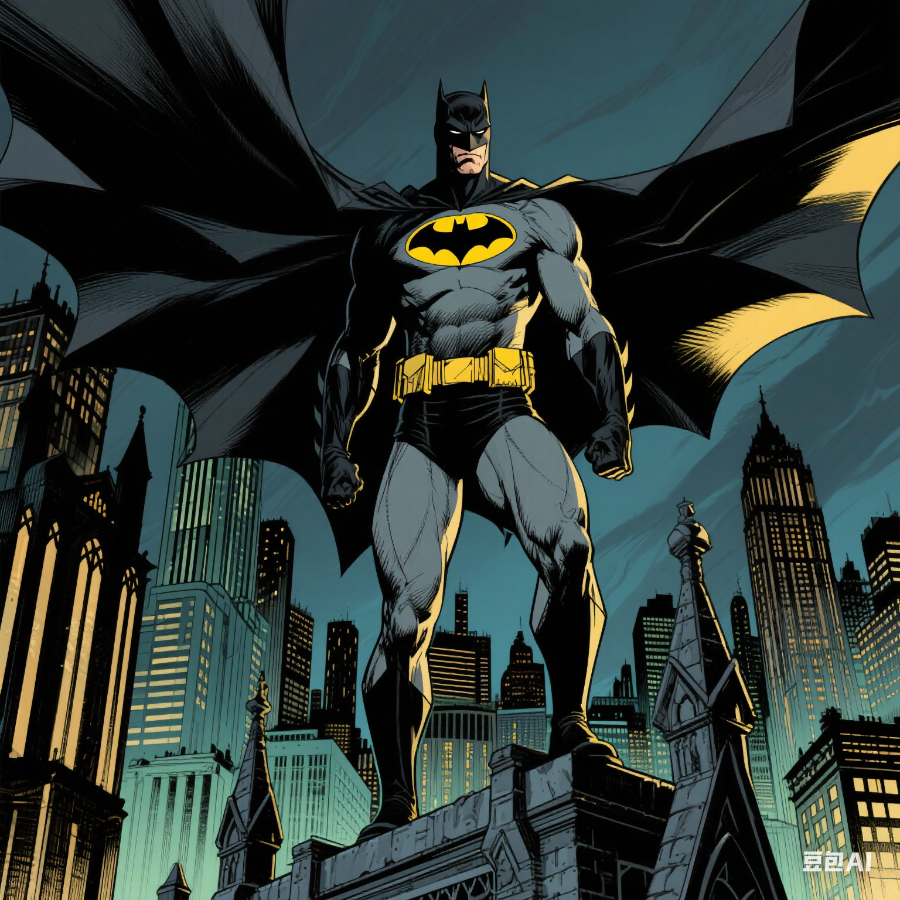

Batman was created by artist Bob Kane and writer Bill Finger. The character made his debut in 1939 in "Detective Comics" #27. The inspiration for Batman came from various sources, including the pulp magazine heroes of the 1930s and the myth of the bat. The most well - known origin story of Batman is that young Bruce Wayne witnessed the murder of his parents, Thomas and Martha Wayne, in an alley. This traumatic event drove him to vow to fight crime and protect the people of Gotham City.

